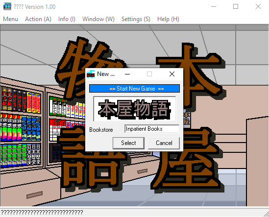

# BookStory - English Translation

*BookStory* is a book store business simulator from KairoSoft. Released as freeware, it has only been available in Japanese until now. 

[Original thread with some more context plus behind the scenes hex editing action!](https://mobile.twitter.com/unrealchill/status/1375828018711650305)

**WINDOWS PLAYABLE ALPHA [HERE](https://github.com/xraymemory/bookstory-en/releases/tag/0.5)**

**MENUS AND UI ELEMENTS ARE 99% TRANSLATED! WE ARE LIVE**

Translated strings are located in the `translation.csv` file. Translated source files and playable binaries are in the `en` directory.

## HOW TO PLAY

As this game is written in VB6, you'll need Visual Studio 6 with VisualBasic installed on your computer. Get it here: https://winworldpc.com/product/microsoft-visual-stu/60

## TO DO
* Translate book and dialogue strings recovered from `module1.bas` https://docs.google.com/spreadsheets/d/1QNyfKYVMm2h6_FBeSjggKUO4sAStSoeXWA4LKOgJPzg/edit?usp=sharing
* Identify method of entry in `module1.bas` and how to patch it. Currently I am editing the .exe directly using VBReFormer but that might not be sustainable since it does some seriously messed up things to the resulting binary. 
